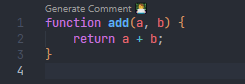
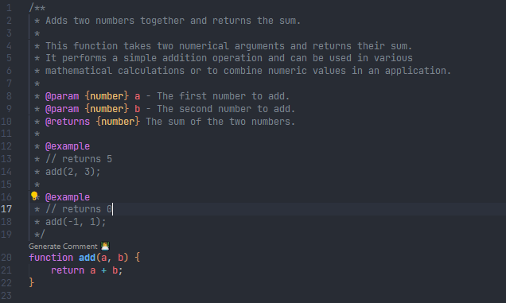
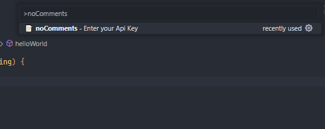
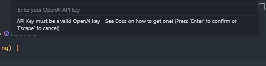
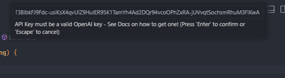
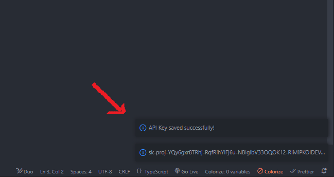
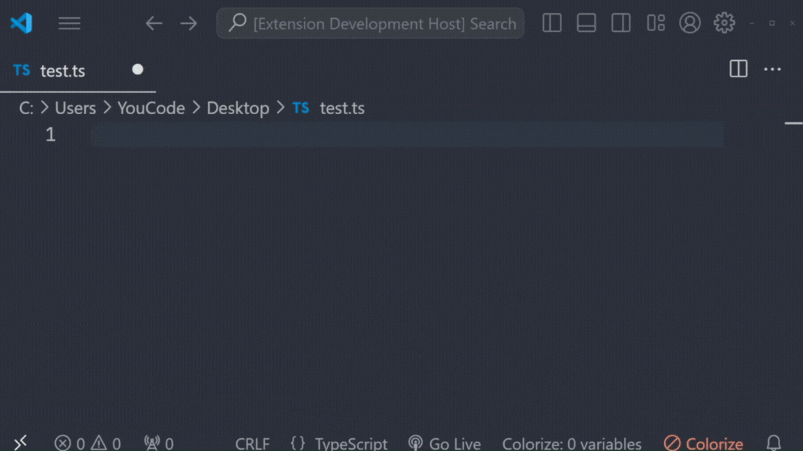

# 👨‍💻 NoComments [](https://github.com/MedNT/noComments) 
Created with ❤️️ by [mntcodes.com](https://www.mntcodes.com)


  

## Overview

**noComments** is a Visual Studio Code extension designed to help developers effortlessly generate documentation comments for their functions and methods. With just a click, you can ensure that your code is well-documented and easier to understand, eliminating the hassle of writing comments manually.

**Before** <br/>
 <br/>

**After** <br/>
 <br/>

## 🌟 Features

- **Generate Comments**: Automatically generates comments for your functions based on their content.
- **Inline Code Lens**: Adds a "Generate Comment 👨‍💻" button next to each function for quick access.
- **Customizable API Key**: Use your own [OpenAI API key](https://platform.openai.com/settings/profile?tab=api-keys) to generate comments, keeping you in control of your usage.


## 🚀 Installation

1. **Install from VSCode Marketplace**:
   - Visit the [VSCode Marketplace](https://marketplace.visualstudio.com) and search for **noComments**.
   - Click "Install" to add the extension to your VSCode.
   
2. **Manual Installation**:
   - Download the latest release from the [Releases](https://github.com/mntcodes/noComments/releases) page.
   - Open VSCode and navigate to `Extensions > Install from VSIX` and select the downloaded `.vsix` file.


## 💡 Usage

1. **Open a JavaScript or TypeScript file** in VSCode.
2. Place your cursor on any function you want to document.
3. Click the "Generate Comment 👨‍💻" button that appears on top of the function.
4. The generated comment will be inserted above the function automatically.

## ⚙️ Configuration

To use the extension, you need to provide your OpenAI API key:

1. Go to **Settings** (`Ctrl + ,` or `Cmd + ,` on Mac).
2. Type noComments and search for `📝 noComments - Enter your Api Key`.

 <br/>

3. Enter your OpenAI API key in the `API Key` field & click ENTER.

 <br/>

 <br/>


4. Congrats you [OpenAI API key](https://platform.openai.com/settings/profile?tab=api-keys) is saved successfully!

 <br/>

## 📃 Example

### Before

```javascript
Generate Comment 👨‍💻
function add(a, b) {
    return a + b;
}
```

### After clicking "Generate Comment"

```javascript
/**
 * Adds two numbers together and returns the sum.
 *
 * This function takes two numerical arguments and returns their sum. 
 * It performs a simple addition operation and can be used in various 
 * mathematical calculations or to combine numeric values in an application.
 *
 * @param {number} a - The first number to add.
 * @param {number} b - The second number to add.
 * @returns {number} The sum of the two numbers.
 *
 * @example
 * // returns 5
 * add(2, 3);
 *
 * @example
 * // returns 0
 * add(-1, 1);
 */
function add(a, b) {
    return a + b;
}
```
---

## ▶️ Demo

 <br/>

---

## 🌱 Contribution

Contributions are welcome! If you have suggestions, features, or improvements, feel free to submit an issue or pull request. 

1. **Fork the repository**
2. **Create a new branch** (`git checkout -b feature/your-feature`)
3. **Commit your changes** (`git commit -m 'Add some feature'`)
4. **Push to the branch** (`git push origin feature/your-feature`)
5. **Open a pull request**

---

## 📄 License

This project is licensed under the MIT License - see the [LICENSE](https://opensource.org/licenses/MIT) file for details.


## 🙏 Acknowledgements

- [OpenAI API](https://openai.com/api/) for their amazing AI Model.
- [Visual Studio Code](https://code.visualstudio.com/) for being an amazing code editor.


---

## 💬 Contact

Feel free to reach out for any questions or suggestions!  

[About Me](https://mntcodes.com) <br/>
[Twitter](https://x.com/NaciriTaoufik) <br/>
[LinkedIn](https://www.linkedin.com/in/mednt/) <br/>
[GitHub](https://github.com/MedNT) <br/>
[Blog](https://mntcode.substack.com/) 


---

> **Note**: This extension is open-source and available on [GitHub](https://github.com/MedNT/noComments). Contributions and suggestions are greatly appreciated!
